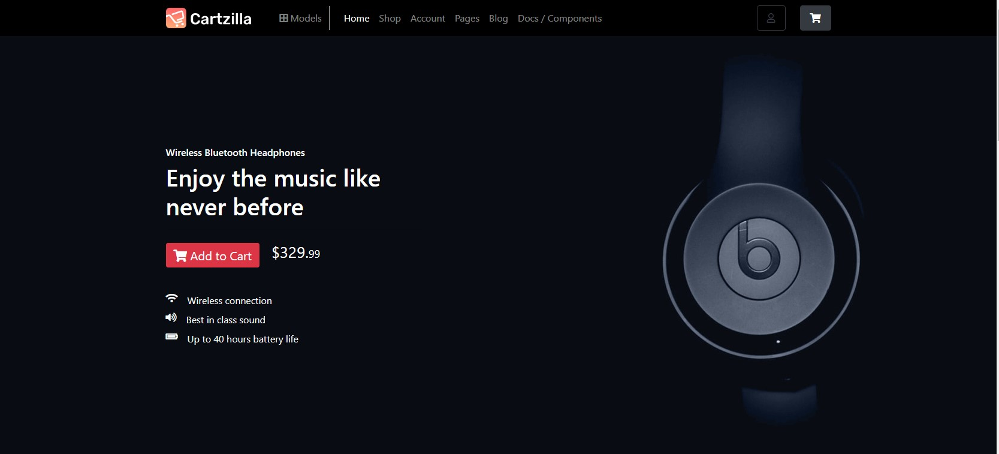
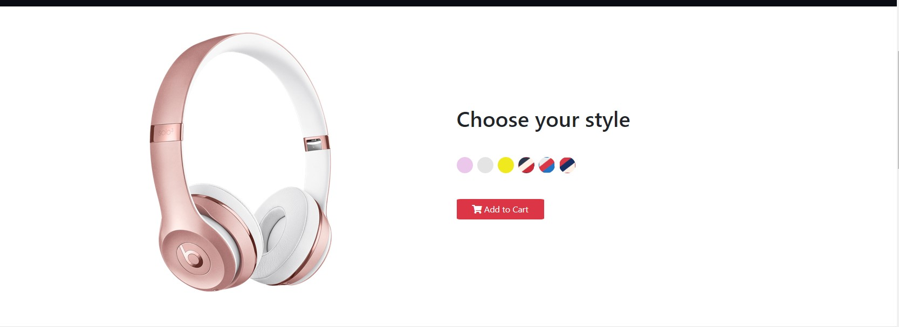
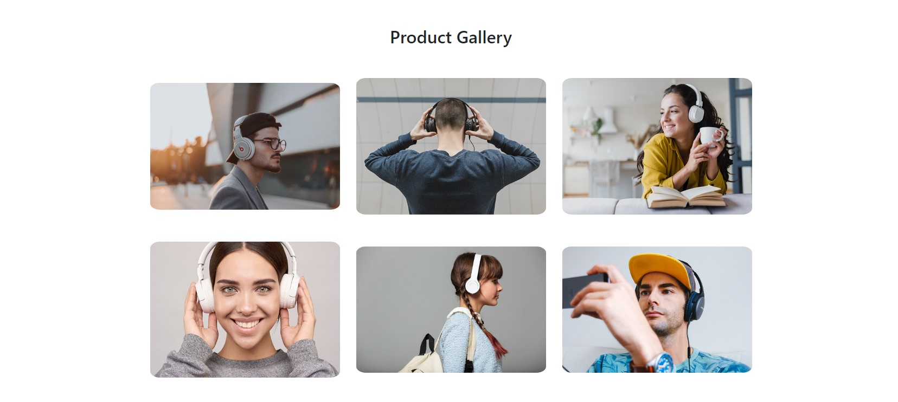
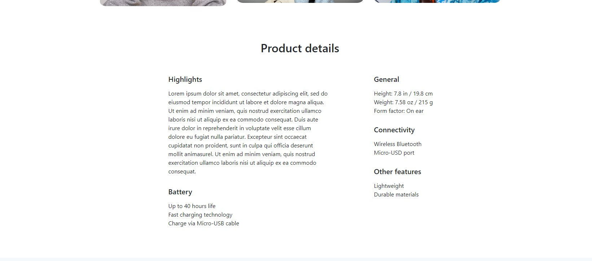
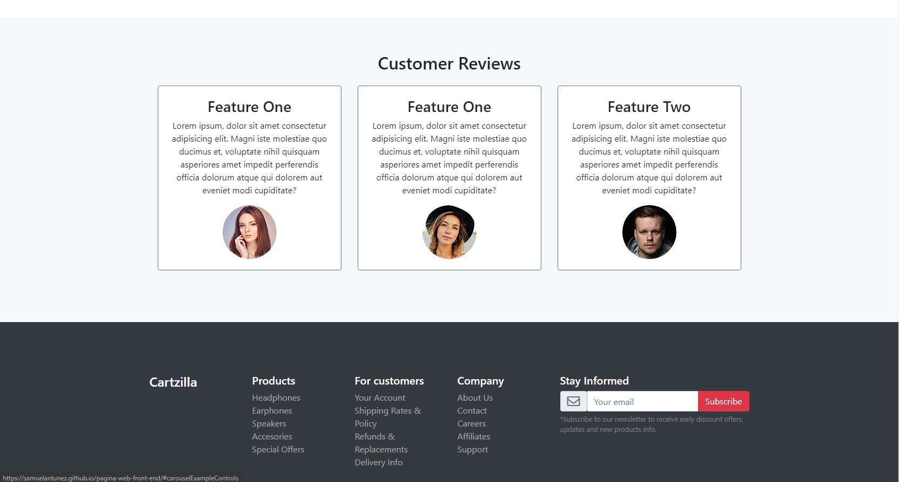

#Pagina Web Cartzilla

Pagina web Test de Front end

## GitHub Page

Puedes apreciar la web final a través de [Página Web](https://samuelantunez.github.io/pagina-web-front-end/)






## Herramientas

Para este proyecto se utilizarón las siguientes herramientas

* [Google Fonts](https://fonts.google.com/)
* [Bootstrap](https://getbootstrap.com/)


## Instalación

[Descargamos](https://github.com/SamuelAntunez/pagina-web-front-end/archive/gh-pages.zip) o clonamos el proyecto a través del siguiente comando

```
git clone https://github.com/SamuelAntunez/pagina-web-front-end.git
```
## Version

1.0.0

[Licencia MIT](LICENSE)

## Expresiones de Gratitud
Este proyecto se realizo gracias al trabajo base de: 

[Cartzila](https://demo.createx.studio/cartzilla/home-single-store.html)
